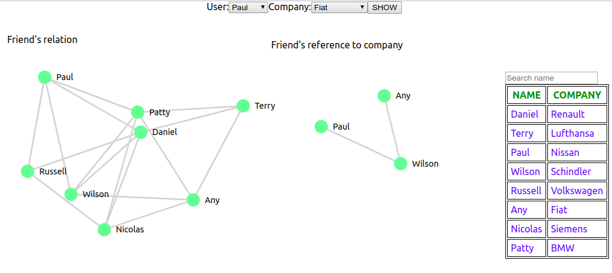

# friends-reference-job
This project finds the friend's reference to work in a specific company, first you choose any user and then the company where you want to work and when you press the show button shows a graphic with the friend's relation from initial user with the friend's relation until the final user. The left graphic shows the friend's relations and the table on the right side shows the companies where each user is working so for example Paul is working in Nissan but if he wants to work in Fiat we see that Any works there but on the graphic we see Paul and Any are not friends but they have one friend in common so what the button does is showing the friends that are in common between Paul and Any so Paul can see which are the friend's relation to contact Any if he needs a reference to work in Fiat.

# Dependencies

- Express
- React
- NodeJS

## How to install?

1) Install dependencies with `npm install` or `yarn install` for backend.
2) Install dependencies with `npm install` or `yarn install` for frontend.

## To run

1) First run the server with `npm start`.
2) Now run the react project with `npm start`.

## Screenshot

